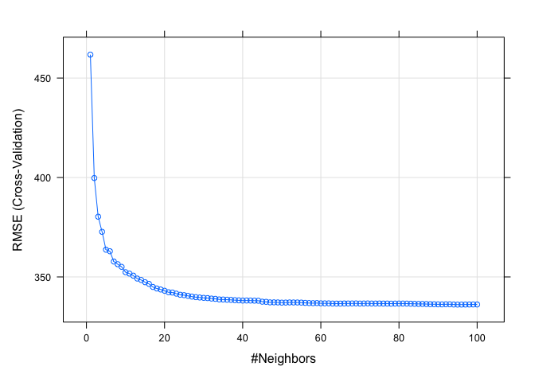
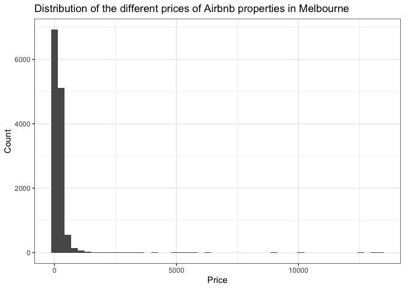
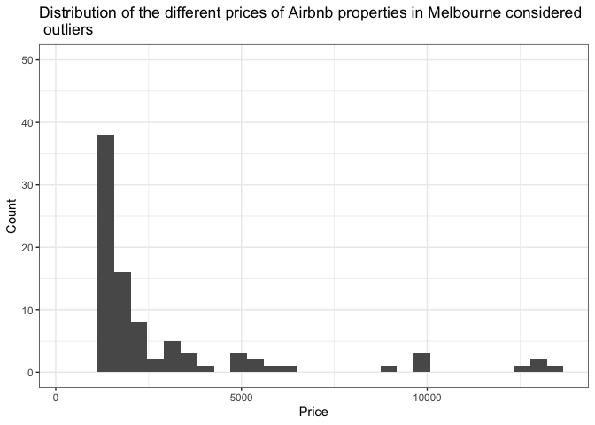
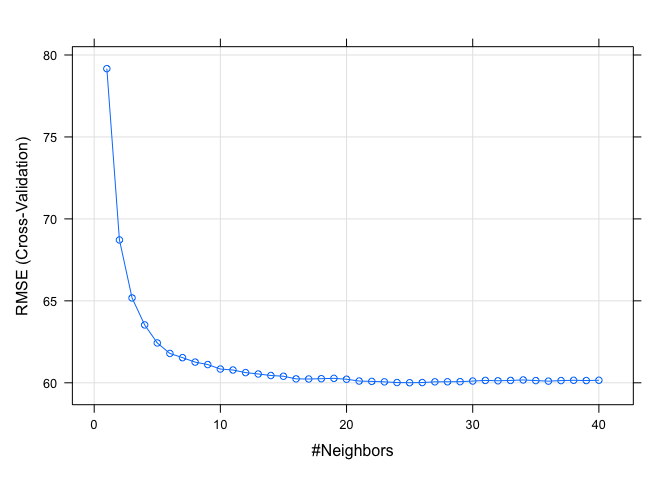

Predicting Airbnb Prices
================
Brendan Octaviano
02/02/2022

# Introduction

In October 2021, Melbourne, previously the worlds most livable city, and
at the same time the [most locked down
city](https://www.reuters.com/world/asia-pacific/melbourne-reopens-worlds-most-locked-down-city-eases-pandemic-restrictions-2021-10-21/),
came out of 262 days of lockdown for what is hopefully the final time.
As a result, people are eager to travel and get out of the area they
have been locked down in for so long.

Airbnb, a popular vacation rental company, connects people who are
looking to travel, with people who are looking for accommodation in
specific places. While [Airbnb services in Melbourne have had some
negative reviews recently due to COVID-19 restrictions and cancellation
policies](https://www.abc.net.au/news/2021-11-30/airbnb-stayz-covid-cancellation-refund-bookings/100658860),
with the end of lockdowns, hopefully this will no longer occur, and
people can go back to enjoying their holidays.

# Our Data

Analysing Airbnb data in Melbourne from [Inside
Airbnb](http://insideairbnb.com/get-the-data.html), we look to explore
*how well we can predict the prices of properties listed on Airbnb*.

``` r
#Setting seed for reproducability
set.seed(30127)

#Loading packages 
library(tidyverse)
library(geosphere)
library(caret)
library(knitr)
library(tidymodels)

#Loading the data
airbnb <- read.csv("listings.csv")

#Initial clean
airbnb_clean <- airbnb %>%
  #Selecting only numerical columns that are useful for our analysis
  select(latitude, longitude, bathrooms_text, bedrooms, reviews_per_month, review_scores_rating, host_total_listings_count, maximum_nights, price) %>%
  mutate(
    #Clean up price column and remove "$"
    price = str_replace_all(price, "\\$", ""),
    #Removing any "," in price column as well
    price = str_replace_all(price, ",", ""),
    #Creating new column with only number of bathrooms, removing the text
    bathrooms = str_extract(bathrooms_text, "\\d+\\.?\\d*")
  ) %>%
  #Ensuring all of our columns are in a numeric format
  mutate_all(as.numeric) 

#Calculating the distance to the city using latitude and longitude from
#LatLong.net (https://www.latlong.net/place/melbourne-vic-australia-27235.html)
dist_mat <- data.frame(airbnb_long = airbnb_clean$longitude,
                       airbnb_lat = airbnb_clean$latitude,
                       melb_long = rep(144.946457, length(airbnb_clean$longitude)),
                       melb_lat = rep(-37.840935, length(airbnb_clean$longitude))) %>%
  rowwise %>%
  mutate(distance_to_city = distm(x = c(airbnb_long, airbnb_lat), 
                                  y = c(melb_long, melb_lat), 
                                  #Dividng by 1000 to get distance in kilometres
                                  fun = distGeo) / 1000)


#Final Clean
airbnb_clean <- airbnb_clean %>%
  #Adding our calculated distances
  bind_cols(distance_to_city = dist_mat$distance_to_city) %>%
  #Only selecting our needed columns
  select(bathrooms, bedrooms, reviews_per_month, review_scores_rating, host_total_listings_count, maximum_nights, distance_to_city, price) %>%
  #Removing any NA or blank values
  drop_na()

head(airbnb_clean) %>%
  kable()
```

| bathrooms | bedrooms | reviews\_per\_month | review\_scores\_rating | host\_total\_listings\_count | maximum\_nights | distance\_to\_city | price |
|----------:|---------:|--------------------:|-----------------------:|-----------------------------:|----------------:|-------------------:|------:|
|       1.0 |        1 |                0.03 |                   4.50 |                            1 |             365 |          14.898270 |    60 |
|       1.0 |        1 |                0.30 |                   4.68 |                           13 |              14 |           3.394169 |    95 |
|       2.5 |        1 |                0.02 |                   4.50 |                            1 |             730 |           3.020933 |  1000 |
|       1.0 |        3 |                1.26 |                   4.83 |                            1 |              14 |          42.059901 |   110 |
|       1.0 |        1 |                1.17 |                   4.71 |                            3 |             365 |          16.647397 |    40 |
|       1.0 |        1 |                1.61 |                   4.88 |                            3 |             365 |          16.153476 |    99 |

# Methodology: K-Nearest Neighbours and Hyperparameter Optimisation

**K-Nearest Neighbours (k-NN)** is a supervised machine learning
technique that can be used for both regression and classification,
however in this case we have used it for regression. Using **k-NN** for
regression provides us an output based on the average value of the
“nearest neighbours” of an object, where “near” is determined with the
concept of distance. Distance, in a literal sense, measures how far one
thing is from another, however in the world of machine learning, it
refers to how similar (or dissimilar) two observations are. The larger
the distance between two observations, the less similar they are, and
vice versa.

By calculating the Euclidian distance between objects based on defined
variables, **k-NN** looks to find the a specified number of the most
similar objects, and in the case of regression, find the average of
these labels. Using **k-NN** will allow us to take a number of important
variables from our data, use this data to find Airbnb properties that
have similar characteristics, then average these out to make our
prediction of their price.

At the same time, we will use **hyperparameter optimisation** to find
the optimal value of k for our **k-NN** model. **Hyperparameter
optimaisation** will take our training set, divide it into a set number
of folds, and will use **[k-fold
cross-validation](https://github.com/brendanoct/nyc-house-prices)** to
calculate the error metrics for each potential value of k for our
**k-NN** model. This will become our *validation error metric* -
specifically root mean square error (RMSE) - and the value of k that
gives us our lowest RMSE will be our considered our *optimal value of
k*.

# Model

``` r
#Splitting the data
airbnb_split <- initial_split(airbnb_clean)
#Using the split data to create our training set
airbnb_train <- training(airbnb_split)
#Using the split data to create our test set
airbnb_test <- testing(airbnb_split)

#Defining that we want to use cross validation with 5 folds when evaluating our k-nearest neighbours model
train_control <- trainControl(method = "cv",
                              number = 5)
#Creating a grid of possible tuning values
knn_grid <- expand.grid(k = 1:100)

#Creating k-nearest neighbours model
knn_model <- train(price ~.,  
                   data = airbnb_train,
                   method = "knn",
                   trControl = train_control,
                   #Standardising our numerical values to ensure no single variable overpowers the formula
                   preProcess = c("center", "scale"),
                   tuneGrid = knn_grid
                   )

knn_model
```

    ## k-Nearest Neighbors 
    ## 
    ## 9659 samples
    ##    7 predictor
    ## 
    ## Pre-processing: centered (7), scaled (7) 
    ## Resampling: Cross-Validated (5 fold) 
    ## Summary of sample sizes: 7726, 7729, 7726, 7728, 7727 
    ## Resampling results across tuning parameters:
    ## 
    ##   k    RMSE      Rsquared    MAE      
    ##     1  461.7767  0.02266360  114.65170
    ##     2  399.7350  0.03644223  104.10335
    ##     3  380.3024  0.04423620  100.47418
    ##     4  372.6794  0.04962224   98.69786
    ##     5  363.6873  0.05792913   97.43847
    ##     6  362.9174  0.05787541   97.44310
    ##     7  357.7486  0.06455719   96.59421
    ##     8  356.4038  0.06709347   96.51860
    ##     9  355.0781  0.06863879   96.28321
    ##    10  352.3814  0.07252608   95.80300
    ##    11  351.6872  0.07251317   95.93213
    ##    12  350.6351  0.07448632   95.96371
    ##    13  349.1888  0.07704391   95.79552
    ##    14  348.4796  0.07773070   95.68525
    ##    15  347.3496  0.08018353   95.35490
    ##    16  346.5130  0.08174387   95.21843
    ##    17  344.9686  0.08669312   94.62149
    ##    18  344.1920  0.08925251   94.32749
    ##    19  343.6927  0.09030606   94.28614
    ##    20  343.0477  0.09233387   94.08664
    ##    21  342.2949  0.09481826   93.71308
    ##    22  342.1452  0.09483092   93.67136
    ##    23  341.6057  0.09661353   93.51357
    ##    24  341.0414  0.09864331   93.35787
    ##    25  340.8358  0.09962435   93.51770
    ##    26  340.4806  0.10052152   93.41384
    ##    27  340.1011  0.10194081   93.24096
    ##    28  339.8340  0.10314779   93.25555
    ##    29  339.6591  0.10368554   93.28006
    ##    30  339.4765  0.10427292   93.18097
    ##    31  339.3611  0.10479302   93.27900
    ##    32  339.1218  0.10558658   93.03957
    ##    33  338.9793  0.10612834   93.14913
    ##    34  338.6866  0.10732658   93.06157
    ##    35  338.6465  0.10741712   93.11371
    ##    36  338.5537  0.10772396   93.08434
    ##    37  338.4671  0.10800913   93.06607
    ##    38  338.3122  0.10862395   92.97393
    ##    39  338.2259  0.10898718   93.01399
    ##    40  338.1128  0.10948477   92.99419
    ##    41  338.1420  0.10916695   93.00781
    ##    42  338.1186  0.10924141   93.00450
    ##    43  338.0690  0.10956181   93.05368
    ##    44  338.0314  0.10958508   93.04599
    ##    45  337.5550  0.11300168   92.99154
    ##    46  337.4757  0.11341892   93.00779
    ##    47  337.2070  0.11481148   92.92187
    ##    48  337.2244  0.11470866   92.93962
    ##    49  337.1809  0.11489170   92.87062
    ##    50  337.0793  0.11536773   92.77549
    ##    51  337.1048  0.11520938   92.88265
    ##    52  337.1763  0.11455252   92.96257
    ##    53  337.1631  0.11456983   92.94214
    ##    54  337.1547  0.11462454   92.96760
    ##    55  337.0922  0.11512604   92.93026
    ##    56  336.9560  0.11601098   92.82235
    ##    57  336.8654  0.11657056   92.70146
    ##    58  336.8122  0.11697100   92.68124
    ##    59  336.8594  0.11662161   92.75839
    ##    60  336.7318  0.11746627   92.61898
    ##    61  336.7112  0.11764483   92.59586
    ##    62  336.7147  0.11765860   92.66799
    ##    63  336.6202  0.11829810   92.57573
    ##    64  336.5973  0.11847921   92.58687
    ##    65  336.5999  0.11850056   92.55709
    ##    66  336.6594  0.11802207   92.72655
    ##    67  336.6438  0.11820633   92.72487
    ##    68  336.6672  0.11802600   92.74795
    ##    69  336.6844  0.11786621   92.82076
    ##    70  336.6139  0.11835047   92.73105
    ##    71  336.6498  0.11805533   92.73442
    ##    72  336.6835  0.11775667   92.81577
    ##    73  336.6285  0.11809340   92.77570
    ##    74  336.6198  0.11817932   92.76272
    ##    75  336.6456  0.11793041   92.79982
    ##    76  336.6084  0.11822792   92.79621
    ##    77  336.6188  0.11820877   92.80810
    ##    78  336.5674  0.11861341   92.84763
    ##    79  336.6029  0.11838234   92.82770
    ##    80  336.6198  0.11826487   92.76239
    ##    81  336.6220  0.11825914   92.75727
    ##    82  336.5939  0.11848347   92.73046
    ##    83  336.5378  0.11893383   92.69921
    ##    84  336.4958  0.11917810   92.66600
    ##    85  336.4385  0.11953031   92.61774
    ##    86  336.4291  0.11958392   92.62762
    ##    87  336.3587  0.12016244   92.63855
    ##    88  336.2816  0.12075728   92.52643
    ##    89  336.2626  0.12096731   92.51771
    ##    90  336.2159  0.12129728   92.47242
    ##    91  336.2010  0.12136107   92.43030
    ##    92  336.2473  0.12108639   92.46837
    ##    93  336.2390  0.12120947   92.48346
    ##    94  336.1359  0.12173442   92.43634
    ##    95  336.0959  0.12203893   92.44687
    ##    96  336.1060  0.12192804   92.39700
    ##    97  336.1217  0.12175872   92.38973
    ##    98  336.1386  0.12164314   92.41770
    ##    99  336.1655  0.12144357   92.40092
    ##   100  336.1527  0.12156517   92.32283
    ## 
    ## RMSE was used to select the optimal model using the smallest value.
    ## The final value used for the model was k = 95.

## Evaluating model

``` r
plot(knn_model)
```

<!-- -->

Looking at the above plot, it is difficult to see the optimal value of
k. After conducting hyperparameter optimsation, the *optimal value of k
= 95*. This is more clear in the above output from our **k-NN** model,
where we can see that the RMSE continues to decrease until k reaches 95,
then following 95 the RMSE begins to decrease.

``` r
#Creating our predictions on our testing set
predictions <- predict(knn_model, airbnb_test) %>%
  as_tibble()

#Printing our results for our model
airbnb_test %>%
  bind_cols(predictions) %>%
  metrics(truth = price, estimate = value) %>%
  kable()
```

| .metric | .estimator |   .estimate |
|:--------|:-----------|------------:|
| rmse    | standard   | 317.1482665 |
| rsq     | standard   |   0.0963688 |
| mae     | standard   |  92.8375615 |

Since we are measuring how well we can predict the price of an Airbnb in
Melbourne, and since the RMSE can be used to penalise large errors, we
can look at the Mean Absolute Error (MAE) to evaluate the performance of
our model. The MAE tells us that on average, our model will predict the
price of the Airbnb with a distance of $92.84, or in other words, *we
will predict the price with an average error of $92.84, either more or
less*.

``` r
#Calculating the range of the prices of our Airbnb's

tibble(min = range(airbnb_clean$price)[1],
       max = range(airbnb_clean$price)[2]) %>%
  kable()
```

| min |   max |
|----:|------:|
|  14 | 13379 |

Since we have quite a large range of different prices for Airbnb’s in
Melbourne, it appears our model does a fairly good job of predicting the
prices.

## Outliers

``` r
#Getting our five number summary to calculate outliers
summary_stats <- summary(airbnb_clean$price)

#(1.5 * IQR) + 3rd Quartile
outlier <- (1.5 * (summary_stats[[5]] - summary_stats[[2]])) + summary_stats[[5]]

airbnb_clean %>%
  ggplot(aes(x = price)) +
  geom_histogram(bins = 50) +
  labs(x = "Price",
       y = "Count",
       title = "Distribution of the different prices of Airbnb properties in Melbourne") +
  theme_bw()
```

<!-- -->

``` r
airbnb_clean %>%
  filter(price > outlier) %>%
  ggplot(aes(x = price)) +
  geom_histogram() +
  ylim(0, 50) +
  labs(x = "Price",
       y = "Count",
       title = "Distribution of the different prices of Airbnb properties in Melbourne considered \n outliers") +
  theme_bw()
```

<!-- -->

As we can see in the above plots, there are some heavy outliers, that
may be potentially skewing the performance of our model. It is not
beneficial for us to remove these as if we do not have them, however, it
would be interesting to see how our model performs after removing the
outliers.

# Model 2

``` r
#Removing outliers
airbnb_clean1 <- airbnb_clean %>%
  filter(price < outlier)

#Splitting the data
airbnb_split1 <- initial_split(airbnb_clean1)
#Using the split data to create our training set
airbnb_train1 <- training(airbnb_split1)
#Using the split data to create our test set
airbnb_test1 <- testing(airbnb_split1)

#Defining that we want to use cross validation with 5 folds when evaluating our k-nearest neighbours model
train_control1 <- trainControl(method = "cv",
                              number = 5)
#Creating a grid of possible tuning values
knn_grid1 <- expand.grid(k = 1:40)

#Creating k-nearest neighbours model
knn_model1 <- train(price ~.,  
                   data = airbnb_train1,
                   method = "knn",
                   trControl = train_control1,
                   #Standardising our numerical values to ensure no single variable overpowers the formula
                   preProcess = c("center", "scale"),
                   tuneGrid = knn_grid1
                   )

knn_model1
```

    ## k-Nearest Neighbors 
    ## 
    ## 8908 samples
    ##    7 predictor
    ## 
    ## Pre-processing: centered (7), scaled (7) 
    ## Resampling: Cross-Validated (5 fold) 
    ## Summary of sample sizes: 7126, 7127, 7125, 7127, 7127 
    ## Resampling results across tuning parameters:
    ## 
    ##   k   RMSE      Rsquared   MAE     
    ##    1  79.16563  0.2520463  56.29225
    ##    2  68.71546  0.3311861  49.95490
    ##    3  65.17857  0.3664675  47.65490
    ##    4  63.53086  0.3841872  46.63859
    ##    5  62.43200  0.3972593  45.89566
    ##    6  61.79044  0.4051373  45.49702
    ##    7  61.53385  0.4079895  45.39458
    ##    8  61.26140  0.4115750  45.23018
    ##    9  61.11225  0.4132456  45.08093
    ##   10  60.83970  0.4173213  44.95116
    ##   11  60.78025  0.4178634  44.98929
    ##   12  60.62130  0.4200795  44.87491
    ##   13  60.53756  0.4211457  44.84985
    ##   14  60.44518  0.4225771  44.80366
    ##   15  60.40039  0.4230976  44.76659
    ##   16  60.23946  0.4259123  44.71126
    ##   17  60.23200  0.4259133  44.71481
    ##   18  60.24994  0.4254167  44.73686
    ##   19  60.27217  0.4248590  44.73274
    ##   20  60.21634  0.4257513  44.69792
    ##   21  60.10742  0.4276534  44.60538
    ##   22  60.08584  0.4279608  44.57969
    ##   23  60.05727  0.4284252  44.56771
    ##   24  60.01568  0.4291959  44.55678
    ##   25  60.00442  0.4293278  44.54700
    ##   26  60.01582  0.4290873  44.58534
    ##   27  60.05929  0.4282236  44.63602
    ##   28  60.06146  0.4281724  44.62644
    ##   29  60.06922  0.4280059  44.65460
    ##   30  60.10599  0.4273086  44.67889
    ##   31  60.14494  0.4265700  44.70795
    ##   32  60.12248  0.4269964  44.73052
    ##   33  60.14440  0.4265795  44.74629
    ##   34  60.17410  0.4260144  44.78338
    ##   35  60.13487  0.4267565  44.74448
    ##   36  60.10144  0.4274082  44.70727
    ##   37  60.13469  0.4267941  44.74908
    ##   38  60.15319  0.4264533  44.75752
    ##   39  60.13716  0.4267687  44.74978
    ##   40  60.15518  0.4264274  44.76737
    ## 
    ## RMSE was used to select the optimal model using the smallest value.
    ## The final value used for the model was k = 25.

## Evaluating second model

``` r
plot(knn_model1)
```

<!-- -->

Looking at the above plot we can see much clearer the optimal value for
k. Using k = 25 is where our RMSE is lowest, and after this number the
RMSE increases, implying that our average error increases.

``` r
#Creating our predictions on our testing set
predictions1 <- predict(knn_model1, airbnb_test1) %>%
  as_tibble()

#Printing our results for our model
airbnb_test1 %>%
  bind_cols(predictions1) %>%
  metrics(truth = price, estimate = value) %>%
  kable()
```

| .metric | .estimator |  .estimate |
|:--------|:-----------|-----------:|
| rmse    | standard   | 58.1527814 |
| rsq     | standard   |  0.4410414 |
| mae     | standard   | 43.3387293 |

Similar to our first model, MAE tells us that on average, our model will
predict the price of the Airbnb with a distance of $43.34, or in other
words, **we will predict the price with an average error of $43.34,
either more or less, for those properties that are less than $380.**

At the same time *R*<sup>2</sup> has significantly increased, with
approximately 44.10% of the variation in price of Airbnb’s in Melbourne
can be explained by the variables we have chosen.

# Conclusion

After our analysis, we were able to not only gain an insight into the
different prices of Airbnb properties in Melbourne, but we were able to
create a model that attempts to predict the prices of these properties.
As Melbourne continues to open back up by easing restrictions, we hope
this model can be useful to those who may be looking to take a holiday
somewhere in Melbourne, allowing them to see what the price should be
based on already active listings.

One improvement that could be made to the model is a slight variation on
the distance to the city variable created. For those looking to stay
closer to the Central Business District (CBD) of Melbourne, this is an
important variable to consider, however a number of Airbnb properties
may be further from the CBD, and instead closer to other popular areas,
like the beaches on the Mornington Peninsula, or the Dandenong Ranges.
Just because these properties are further from the city, does not mean
that this should affect price, as they are closer to other desirable
areas that aren’t the CBD.
